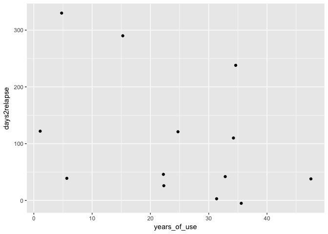

Project Part 1
================
Sara Altman
10/25/2017

``` r
library(tidyverse)
```

    ## Warning: package 'dplyr' was built under R version 3.4.2

### Continous response variable

One possibility for a continuous response variable is the variable `obstime` which is a measure of how long the subject was sober in days. This would be interesting to use as a response variable because it would allow us to predict/learn more about relapsing habits than just using relapse/no relapse as the response.

### Binary response variable

For a binary response variable, one possibility is the variable `relapse`, which is 1 if the subject relapsed and 0 otherwise. This would be a useful response variable since we're interested in being able to predict if someone will relapse or not given certain characteristics, as well as inferring what types of characteristics are associated with relapse.

We also might get data for healthy controls as well. In that case, we could also use whether or not someone is a drug user as a binary response variable.

### Questions to answer

We want to know what characteristics (e.g., time sober, mental illness history, other drug use history, education level, age) are important predictors of methamphetamine use relapse, and if we can accurately predict relapse using these characteristics. We also want to know if NAcc response during a fMRI task can predict relapse well.

This dataset is exciting because it can help us learn about what predicts relapse, as well as a potential way to predict if a new patient will relapse. This would be useful for people working with past and present methamphetamine users, as well as a addition to the scientific literature on addiction and relapse.

``` r
set.seed(1)
data <- read_csv("~/Documents/MS&E 226/mini_project/data/relapse.csv")
```

    ## Parsed with column specification:
    ## cols(
    ##   .default = col_double(),
    ##   subjid = col_character(),
    ##   obstime = col_integer(),
    ##   censored = col_integer(),
    ##   relIn6Mos = col_integer(),
    ##   poly_drug_dep = col_integer(),
    ##   depression_diag = col_integer(),
    ##   ptsd_diag = col_integer(),
    ##   age = col_integer(),
    ##   clinical_diag = col_integer(),
    ##   bis = col_integer()
    ## )

    ## See spec(...) for full column specifications.

``` r
#split into train and test set
train <- sample_frac(data, .8)
test <- 
  data %>% 
  anti_join(train, by = "subjid")
```

The following table gives the percentage of rows with NA values for a given variable.

``` r
train %>% 
  summarise_all(function(x) {mean(is.na(x))}) %>% 
  knitr::kable()
```

|  subjid|    relapse|  days2relapse|  obstime|  censored|  relIn6Mos|  years\_of\_use|  days\_sober|  poly\_drug\_dep|      smoke|  depression\_diag|        bdi|  ptsd\_diag|  education|  age|  clinical\_diag|  pref\_drug|  pref\_food|  pref\_neut|   pa\_drug|   pa\_food|   pa\_neut|  pa\_drugcue|  pa\_foodcue|  pa\_neutcue|    craving|  bam\_upset|  bam\_stimuse|  bam\_riskysituations|  bis|  nacc\_drugs\_TR3|  nacc\_drugs\_TR4|  nacc\_drugs\_TR5|  nacc\_drugs\_TR6|  nacc\_drugs\_TR7|  nacc\_drugs\_TR567mean|  nacc\_food\_TR3|  nacc\_food\_TR4|  nacc\_food\_TR5|  nacc\_food\_TR6|  nacc\_food\_TR7|  nacc\_food\_TR567mean|  nacc\_neutral\_TR3|  nacc\_neutral\_TR4|  nacc\_neutral\_TR5|  nacc\_neutral\_TR6|  nacc\_neutral\_TR7|  nacc\_neutral\_TR567mean|  nacc\_drugs\_beta|  nacc\_food\_beta|  nacc\_neutral\_beta|  mpfc\_drugs\_TR3|  mpfc\_drugs\_TR4|  mpfc\_drugs\_TR5|  mpfc\_drugs\_TR6|  mpfc\_drugs\_TR7|  mpfc\_drugs\_TR567mean|  mpfc\_food\_TR3|  mpfc\_food\_TR4|  mpfc\_food\_TR5|  mpfc\_food\_TR6|  mpfc\_food\_TR7|  mpfc\_food\_TR567mean|  mpfc\_neutral\_TR3|  mpfc\_neutral\_TR4|  mpfc\_neutral\_TR5|  mpfc\_neutral\_TR6|  mpfc\_neutral\_TR7|  mpfc\_neutral\_TR567mean|  mpfc\_drugs\_beta|  mpfc\_food\_beta|  mpfc\_neutral\_beta|  vta\_drugs\_TR3|  vta\_drugs\_TR4|  vta\_drugs\_TR5|  vta\_drugs\_TR6|  vta\_drugs\_TR7|  vta\_drugs\_TR567mean|  vta\_food\_TR3|  vta\_food\_TR4|  vta\_food\_TR5|  vta\_food\_TR6|  vta\_food\_TR7|  vta\_food\_TR567mean|  vta\_neutral\_TR3|  vta\_neutral\_TR4|  vta\_neutral\_TR5|  vta\_neutral\_TR6|  vta\_neutral\_TR7|  vta\_neutral\_TR567mean|  vta\_drugs\_beta|  vta\_food\_beta|  vta\_neutral\_beta|  acing\_drugs\_TR3|  acing\_drugs\_TR4|  acing\_drugs\_TR5|  acing\_drugs\_TR6|  acing\_drugs\_TR7|  acing\_drugs\_TR567mean|  acing\_food\_TR3|  acing\_food\_TR4|  acing\_food\_TR5|  acing\_food\_TR6|  acing\_food\_TR7|  acing\_food\_TR567mean|  acing\_neutral\_TR3|  acing\_neutral\_TR4|  acing\_neutral\_TR5|  acing\_neutral\_TR6|  acing\_neutral\_TR7|  acing\_neutral\_TR567mean|  acing\_drugs\_beta|  acing\_food\_beta|  acing\_neutral\_beta|  ains\_drugs\_TR3|  ains\_drugs\_TR4|  ains\_drugs\_TR5|  ains\_drugs\_TR6|  ains\_drugs\_TR7|  ains\_drugs\_TR567mean|  ains\_food\_TR3|  ains\_food\_TR4|  ains\_food\_TR5|  ains\_food\_TR6|  ains\_food\_TR7|  ains\_food\_TR567mean|  ains\_neutral\_TR3|  ains\_neutral\_TR4|  ains\_neutral\_TR5|  ains\_neutral\_TR6|  ains\_neutral\_TR7|  ains\_neutral\_TR567mean|  ains\_drugs\_beta|  ains\_food\_beta|  ains\_neutral\_beta|
|-------:|----------:|-------------:|--------:|---------:|----------:|---------------:|------------:|----------------:|----------:|-----------------:|----------:|-----------:|----------:|----:|---------------:|-----------:|-----------:|-----------:|----------:|----------:|----------:|------------:|------------:|------------:|----------:|-----------:|-------------:|---------------------:|----:|-----------------:|-----------------:|-----------------:|-----------------:|-----------------:|-----------------------:|----------------:|----------------:|----------------:|----------------:|----------------:|----------------------:|-------------------:|-------------------:|-------------------:|-------------------:|-------------------:|-------------------------:|------------------:|-----------------:|--------------------:|-----------------:|-----------------:|-----------------:|-----------------:|-----------------:|-----------------------:|----------------:|----------------:|----------------:|----------------:|----------------:|----------------------:|-------------------:|-------------------:|-------------------:|-------------------:|-------------------:|-------------------------:|------------------:|-----------------:|--------------------:|----------------:|----------------:|----------------:|----------------:|----------------:|----------------------:|---------------:|---------------:|---------------:|---------------:|---------------:|---------------------:|------------------:|------------------:|------------------:|------------------:|------------------:|------------------------:|-----------------:|----------------:|-------------------:|------------------:|------------------:|------------------:|------------------:|------------------:|------------------------:|-----------------:|-----------------:|-----------------:|-----------------:|-----------------:|-----------------------:|--------------------:|--------------------:|--------------------:|--------------------:|--------------------:|--------------------------:|-------------------:|------------------:|---------------------:|-----------------:|-----------------:|-----------------:|-----------------:|-----------------:|-----------------------:|----------------:|----------------:|----------------:|----------------:|----------------:|----------------------:|-------------------:|-------------------:|-------------------:|-------------------:|-------------------:|-------------------------:|------------------:|-----------------:|--------------------:|
|       0|  0.1290323|     0.5483871|        0|         0|          0|       0.1612903|    0.1290323|                0|  0.0322581|                 0|  0.0322581|           0|  0.0322581|    0|               0|           0|           0|           0|  0.0322581|  0.0322581|  0.0322581|    0.0967742|    0.0967742|    0.0967742|  0.0322581|   0.0322581|     0.0967742|             0.0322581|    0|                 0|                 0|                 0|                 0|                 0|                       0|                0|                0|                0|                0|                0|                      0|                   0|                   0|                   0|                   0|                   0|                         0|                  0|                 0|                    0|                 0|                 0|                 0|                 0|                 0|                       0|                0|                0|                0|                0|                0|                      0|                   0|                   0|                   0|                   0|                   0|                         0|                  0|                 0|                    0|                0|                0|                0|                0|                0|                      0|               0|               0|               0|               0|               0|                     0|                  0|                  0|                  0|                  0|                  0|                        0|                 0|                0|                   0|                  0|                  0|                  0|                  0|                  0|                        0|                 0|                 0|                 0|                 0|                 0|                       0|                    0|                    0|                    0|                    0|                    0|                          0|                   0|                  0|                     0|                 0|                 0|                 0|                 0|                 0|                       0|                0|                0|                0|                0|                0|                      0|                   0|                   0|                   0|                   0|                   0|                         0|                  0|                 0|                    0|

If we are predicting relapse, we will exclude rows with "NA" for relapse, since we don't know if they relapsed or not. If a row does not have an "NA" value but has other "NA" values, we may still work with the remaining columns. `days2sober` has a lot of "NA"s because many of the patients never relapsed during the period when the study was conducted.

``` r
train %>% 
  filter(relapse == 1) %>% 
  ggplot(aes(years_of_use, days2relapse)) +
  geom_point()
```

    ## Warning: Removed 1 rows containing missing values (geom_point).


